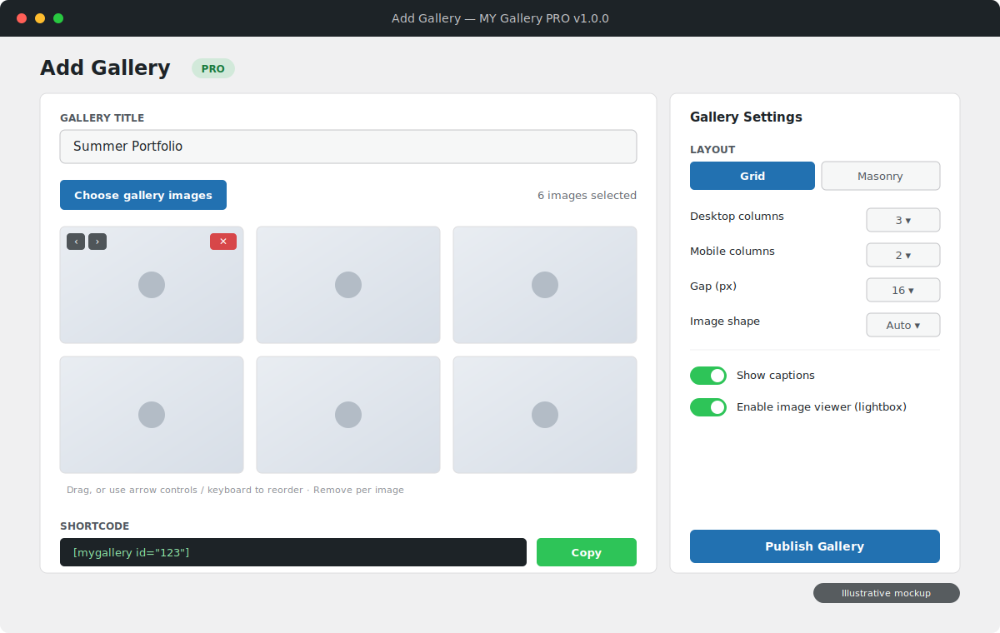
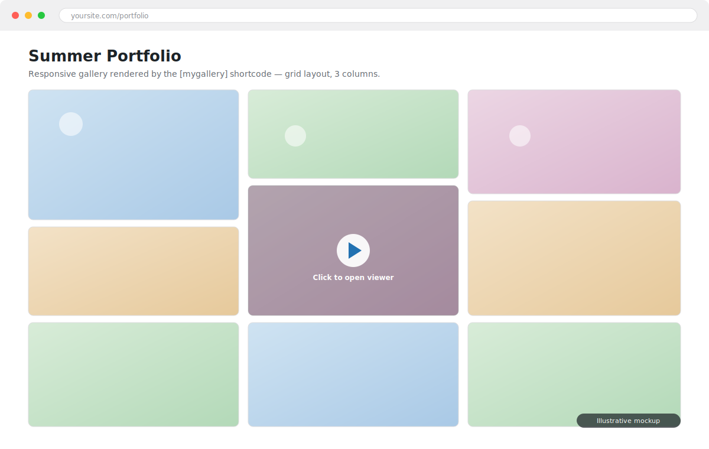

# MY Gallery PRO

MY Gallery PRO is a modern, open-source photo-gallery plugin for WordPress. This repository contains the plugin code and small, dependency-free local verification tools.

Version 1.0.0 creates responsive galleries with exact Grid and Masonry column controls, accurate versioned admin titles, and a one-click copyable shortcode.

[](LICENSE)

**MY Gallery PRO is free and open source under the MIT License. If it helps you build galleries, please consider supporting continued development and WordPress compatibility testing:**

[](https://github.com/sponsors/aminudinmurad)
[](https://ko-fi.com/aminudinmurad)
[](https://www.paypal.com/paypalme/aminudinmurad)

## Download

Download the official plugin package from the [v1.0.0 GitHub Release](https://github.com/AminudinMurad/my-gallery-pro/releases/tag/v1.0.0), then upload `my-gallery-pro-1.0.0.zip` in WordPress from **Plugins > Add New > Upload Plugin**.

## Overview

MY Gallery PRO lets photographers, creatives, and content-rich sites build
responsive image galleries straight from the native WordPress Media Library —
then drop them anywhere with a single shortcode. Images keep their WordPress
responsive sources and alternative text, and the optional viewer is a
progressive enhancement over ordinary full-image links, so galleries stay fast
and accessible even without JavaScript.

### Highlights

- **Native Media Library workflow** — pick images in the familiar media modal; no re-uploading.
- **Grid and Masonry layouts** with **separate desktop (1–6) and mobile (1–3) column** controls and adjustable gap.
- **Accessible by default** — keyboard-operable image reordering, preserved alt text, and a first-party image viewer with keyboard navigation.
- **One shortcode** — `[mygallery id="123"]`, with **one-click copy** from the admin and a screen-reader-friendly confirmation.
- **Container-responsive** — layouts adapt to narrow theme and page-builder regions, not just the viewport.
- **Safe multi-author use** — gallery isolation, per-attachment access checks, capability + nonce protection, and bounded queries.
- **No dependencies** — WordPress-native code with a small first-party autoloader; no build step or third-party runtime packages.

## Screenshots

### Add Gallery editor



### Responsive front-end gallery



> Screenshots are illustrative mockups of the plugin interface.

## Requirements

- WordPress 6.5 or newer
- PHP 7.4 or newer

## Local development

```bash
git clone https://github.com/AminudinMurad/my-gallery-pro.git
cd my-gallery-pro
```

Symlink or copy the project into `wp-content/plugins/my-gallery-pro`, then activate **MY Gallery PRO** in WordPress.

Run the dependency-free syntax and smoke tests before publishing a change:

```bash
bash tools/check.sh
```

## Architecture principles

- WordPress APIs first, including the media library and block editor.
- Namespaced PHP with a small bootstrap and first-party autoloader.
- Output escaped late; input sanitized and authorized at every boundary.
- Assets loaded only where a gallery needs them.
- Accessible, responsive markup that works without JavaScript where practical.
- Public hooks use the `my_gallery_pro_` prefix.
- User data is preserved on uninstall until an explicit opt-in deletion setting exists.

Main files:

- `my-gallery-pro.php` defines the plugin identity, version, and bootstrap constants.
- `src/AdminPage.php` provides capability- and nonce-protected gallery management.
- `src/GalleryPostType.php` stores gallery titles, ordered attachment IDs, and layout settings.
- `src/GalleryShortcode.php` renders published galleries with responsive WordPress images.
- `src/Plugin.php` registers plugin services and lifecycle hooks.
- `assets/` contains first-party, screen-scoped admin and gallery assets.

## Using the gallery

1. Open **MY Gallery PRO > Add Gallery** in WordPress.
2. Name the gallery and choose images from the Media Library.
3. Reorder images with drag and drop or the keyboard-accessible arrow controls, and use **Gallery Preview** for a quick layout check.
4. Choose a grid or masonry layout, desktop and mobile columns, spacing, image shape, captions, and viewer behavior.
5. Save, then paste the generated shortcode into a post or page:

```text
[mygallery id="123"]
```

The shortcode renders responsive image markup through WordPress. Full-image links continue to work when JavaScript is unavailable.

Only image attachments the current user is allowed to edit can be saved. Images attached to draft or private content may remain in a gallery while a site is being built, but the public shortcode suppresses them until their effective WordPress status becomes published.

## Releases

Releases are built and verified locally. Run `bash tools/check.sh`, build only the files allowed by `.distignore`, verify the archive root and contents, then write the approved package to `releases/my-gallery-pro-<version>.zip`.

The local releases folder is ignored by Git and excluded from package inputs. Git tags and GitHub Releases are created manually only after the package has passed the release checklist.

Version references must agree in:

- `my-gallery-pro.php`
- `readme.txt` (`Stable tag`)
- the Git tag

## Originality and provenance

MY Gallery PRO is independently designed and implemented. The plugin does not include source code, templates, interface assets, branding, or derivative materials from other gallery products.

Official release archives contain only first-party MY Gallery PRO files under the MIT License. The plugin and its local test runner require no third-party dependency manager or runtime packages.

## Support development

MY Gallery PRO is free to use. Optional tips and other support help fund continued development, WordPress and PHP compatibility testing, and new features:

- [GitHub Sponsors](https://github.com/sponsors/aminudinmurad) — recurring support
- [Ko-fi](https://ko-fi.com/aminudinmurad) — quick one-time support
- [PayPal](https://www.paypal.com/paypalme/aminudinmurad) — direct support

Thank you for helping keep MY Gallery PRO improving and freely available.

## License

MY Gallery PRO is released under the MIT License. See [LICENSE](LICENSE). You are free to use, copy, modify, merge, publish, distribute, sublicense, and sell copies of the software, subject to the terms of that license.
